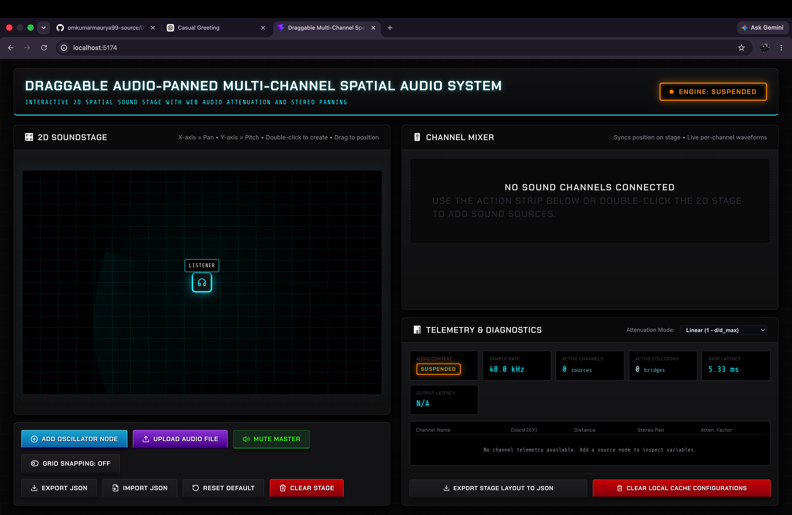
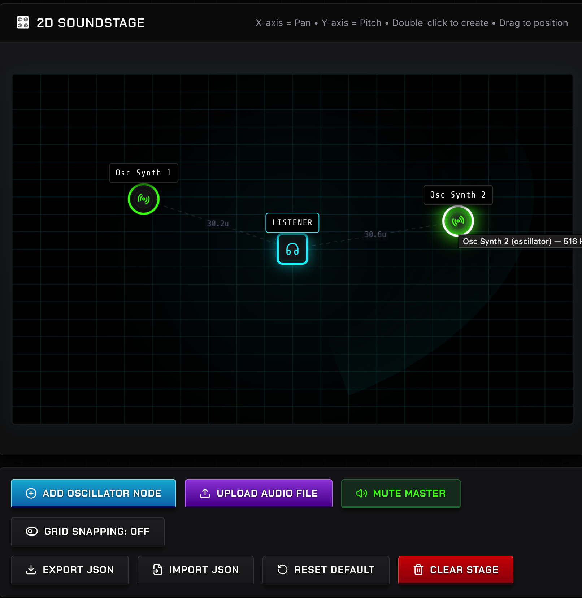
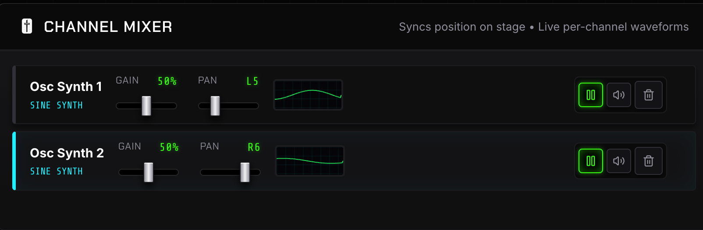
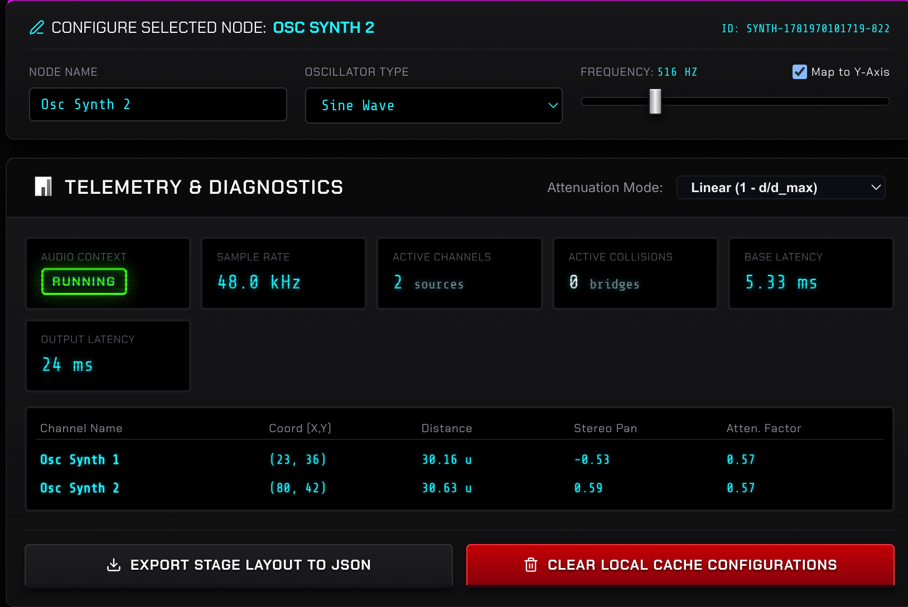

# Draggable Audio-Panned Multi-Channel Spatial Audio System

## 🌟 Project Description

The **Draggable Audio-Panned Multi-Channel Spatial Audio System** is an interactive web application that simulates a spatial audio environment. It allows users to position audio sources within a virtual 2D space relative to a central listener, dynamically adjusting the volume and stereo panning based on distance and position.

The purpose of spatial audio simulation is to create an immersive listening experience by mimicking how sound behaves in the real world. This project leverages the powerful **Web Audio API** in conjunction with **React** to provide a seamless, real-time audio manipulation playground.

## 🚀 Live Demo

Check out the live application here:
[Live Demo on Vercel](https://draggable-audio-panned-multi-channe-five.vercel.app/)

## 📸 Screenshots

## Screenshots

### Main Dashboard


### Sound Stage


### Channel Mixer


### Telemetry Panel


## ✨ Key Features

- **Draggable audio sources**: Intuitively move audio nodes around the listener on a 2D canvas.
- **Real-time stereo panning**: Audio shifts between the left and right speakers based on the source's X-axis position.
- **Distance-based attenuation**: Volume naturally decreases as the audio source moves further away from the listener.
- **Multi-channel audio support**: Manage and playback multiple independent audio tracks simultaneously.
- **Oscillator generation**: Generate distinct tones (Sine, Square, Sawtooth, Triangle) dynamically without needing external files.
- **Audio file upload**: Load your custom audio files (`.mp3`, `.wav`) directly into the scene.
- **Channel mixer**: Individual volume and mute controls for each audio channel.
- **Telemetry and diagnostics panel**: Real-time visual feedback of Euclidean distances, panning values, and gain levels.
- **Local storage persistence**: Your session (nodes, positions, settings) is saved locally and restored on reload.
- **JSON export/import**: Easily save your complex scenes to a file and share or load them later.
- **Interactive sound stage**: A responsive grid representing the listening environment.

## 🛠 Tech Stack

| Technology | Usage |
| :--- | :--- |
| **React** | UI library for building the interactive component-based interface |
| **Vite** | Extremely fast build tool and development server |
| **JavaScript** | Core programming language for application logic |
| **Web Audio API** | Native browser API for low-latency audio processing, routing, and synthesis |
| **CSS** | Styling the layout and components |
| **Local Storage** | Browser storage for persisting state across sessions |

## 🏗 System Architecture

The project is built on a modular architecture using the Web Audio API routing graph:

- **Audio Context**: The master container that manages the creation, execution, and timing of all audio nodes.
- **Listener**: The fixed central point (0,0) on the canvas representing the user's ears.
- **Audio Sources**: Can be either uploaded media files (`MediaElementAudioSourceNode`) or generated tones (`OscillatorNode`).
- **Stereo Panner Nodes**: Connected to each source to distribute the audio signal between the left and right speakers based on the X-coordinate.
- **Gain Nodes**: Connected after the panner to control the volume based on distance (attenuation) and the manual mixer controls.
- **State Management**: React's `useState` and `useEffect` hooks manage the position, playback state, and settings of each node, dynamically updating the Web Audio API parameters in real-time.

## 🧮 Spatial Audio Mathematics

To make the audio behave realistically, several mathematical concepts are applied:

### Euclidean Distance Formula
Calculates the straight-line distance between the audio source ($x_2, y_2$) and the listener ($x_1, y_1$ at center $0,0$).
`Distance = √((x2 - x1)² + (y2 - y1)²)`
The greater this distance, the quieter the sound becomes.

### Stereo Panning Logic
Determines how much sound goes to the left or right speaker. It's mapped from the source's X position on the grid.
- **Center**: X = 0 (Equal in both ears)
- **Far Left**: X = -1 (Full left ear)
- **Far Right**: X = 1 (Full right ear)

### Distance Attenuation
As an object moves further away, the volume (gain) drops. We use a mapped calculation:
`Gain = 1 - (Distance / Max_Distance)`
Ensuring the volume never drops below 0 and maxes out at 1 when right next to the listener.

### Coordinate Mapping
The screen pixels are mapped to an internal coordinate system (e.g., -100 to 100) to keep math consistent regardless of the browser window size.

## 📁 Project Structure

```text
Draggable-Audio-Panned-Multi-Channel-Playground/
├── public/                 # Static assets
├── src/
│   ├── assets/             # Images, icons
│   ├── audio/              # Default audio files
│   ├── components/         # React components
│   │   ├── ActionStrip.jsx # Top control bar (Import/Export/Clear)
│   │   ├── Mixer.jsx       # Volume/Mute controls per channel
│   │   ├── SoundStage.jsx  # The interactive 2D draggable canvas
│   │   └── TelemetryPanel.jsx # Real-time data readouts
│   ├── App.css             # Main application styles
│   ├── App.jsx             # Root component and state manager
│   ├── index.css           # Global styles and resets
│   └── main.jsx            # React entry point
├── .gitignore
├── eslint.config.js        # Linter configuration
├── index.html              # Main HTML template
├── package.json            # Dependencies and scripts
├── package-lock.json
├── README.md               # Project documentation
└── vite.config.js          # Vite bundler configuration
```

## 💻 Installation and Setup

Follow these steps to run the project locally:

1. **Clone the repository:**
   ```bash
   git clone https://github.com/omkumarmaurya99-source/Draggable-Audio-Panned-Multi-Channel-Playground.git
   ```

2. **Navigate to the project directory:**
   ```bash
   cd Draggable-Audio-Panned-Multi-Channel-Playground
   ```

3. **Install dependencies:**
   ```bash
   npm install
   ```

4. **Start the development server:**
   ```bash
   npm run dev
   ```

## 📦 Build for Production

To create an optimized production build:

1. **Generate the build:**
   ```bash
   npm run build
   ```

2. **Preview the production build locally:**
   ```bash
   npm run preview
   ```

## 📖 Usage Guide

1. **Add a Node:** Click on the generic "+ Node" button, or select an Oscillator tone (Sine, Square, etc.) to add a new sound source to the stage.
2. **Upload Audio:** Click the "Upload" button to add your own `.mp3` or `.wav` files.
3. **Drag to Pan/Attenuate:** Click and drag the nodes around the central listener on the grid. Notice how the sound shifts from left to right and gets quieter as it moves further away.
4. **Mixer Controls:** Use the sliders in the Mixer panel to manually adjust the volume of individual tracks or mute them entirely.
5. **Telemetry:** Watch the Telemetry panel to see the exact numerical values for distance, pan, and volume changing in real-time.
6. **Export/Import:** Save an interesting layout by clicking "Export JSON", and reload it later using "Import JSON".

## 🚧 Challenges Faced

- **Managing AudioContext State:** Browsers strictly require user interaction before allowing audio to play. Ensuring the `AudioContext` was properly resumed upon the first click without crashing the app required careful state handling.
- **Performance Optimization:** Continuously updating React state and Web Audio nodes simultaneously on every mouse move (`onDrag`) caused noticeable lag. This was mitigated by optimizing rendering cycles and directly interacting with Audio Node parameters where possible.
- **Complex State Synchronization:** Keeping the visual UI (sliders, node positions), the React state, and the underlying Web Audio nodes perfectly in sync, especially when loading a saved session from Local Storage or JSON.

## 🔮 Future Improvements

- **3D Spatial Audio:** Upgrading from standard Stereo Panning to full 3D spatialization using `PannerNode` for Z-axis depth and elevation.
- **Reverb and Environment Effects:** Adding a `ConvolverNode` to simulate different room sizes (e.g., small room, large hall, cave).
- **Mobile Touch Support:** Enhancing the drag-and-drop mechanics to fully support multi-touch on mobile and tablet devices.
- **Audio Visualizers:** Adding waveform or frequency bar visualizers for each channel to provide better visual feedback.

## 🎓 Learning Outcomes

Through building this project, I gained a deep understanding of:
- Bridging complex browser APIs (`Web Audio API`) with modern UI frameworks (`React`).
- Implementing coordinate geometry and mathematical mapping in practical applications.
- Advanced React state management, including lifting state up and utilizing `useEffect` for side-effects and cleanup.
- Creating a polished, professional-grade development environment using Vite and proper project structuring.

## 👤 Author

**Name:** Om Kumar Maurya  
**Program:** B.Tech CSE (First Year)  

## 📄 License

This project is open-source and available under the [MIT License](LICENSE).

## 🙏 Acknowledgements

- **MDN Web Docs:** For the extensive and detailed documentation on the Web Audio API.
- **React Documentation:** For guidance on hooks and component lifecycles.
- **Vite:** For providing a lightning-fast build tool.
